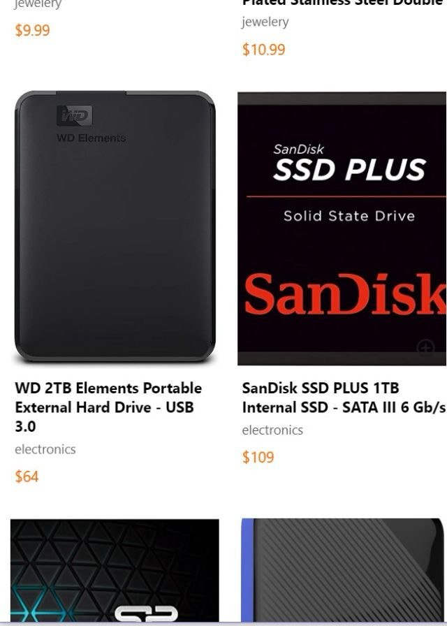
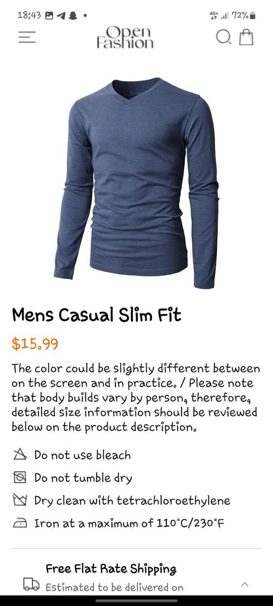

# -rn-assignment7-11327734

This React Native application showcases a simple e-commerce product listing screen. It utilizes `AsyncStorage` for local data persistence.

### Design Choices

* **Data Storage:** The application uses `AsyncStorage` for storing the user's cart data. This choice was made due to its simplicity and suitability for small-scale data storage. 
* **Navigation:** The app uses `react-navigation` for managing navigation between screens. A `StackNavigator` is used to navigate from the `HomeScreen` to a `ProductDetails` screen (not shown in the provided code).
* **UI Design:** The `HomeScreen` displays products in a grid layout using `FlatList` with two columns. Each product item includes an image, name, description, price, and an "Add to Cart" button.

### Implementation Details

* **Product Data:** The `products` array contains hardcoded product data. In a real-world application, this data would be fetched from an API or database.
* **Cart Functionality:** 
    * The `addToCart` function handles adding products to the cart.
    * It retrieves the existing cart data from `AsyncStorage`, adds the selected product, and then updates the cart data in `AsyncStorage`.
* **Navigation:** The `TouchableOpacity` component on each product item triggers navigation to the `ProductDetails` screen, passing the selected product as a parameter.

 **API Integration:** Implemented API calls to fetch product data dynamically.

* **Cart Management:** Add features for viewing, editing, and removing items from the cart.
* **Checkout Functionality:** Implemented a checkout process for completing purchases.
